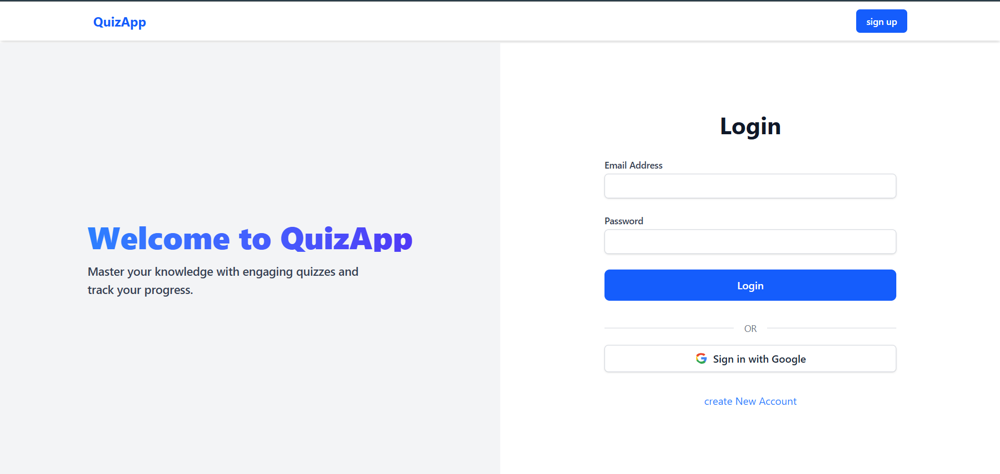
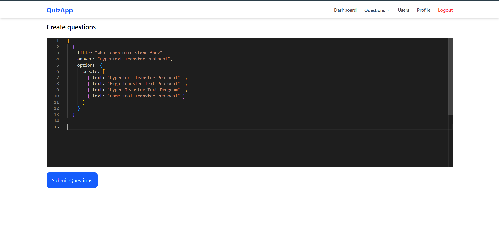
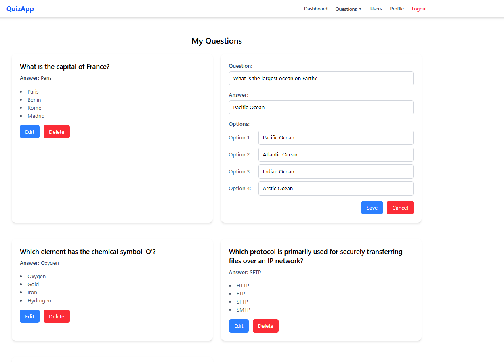
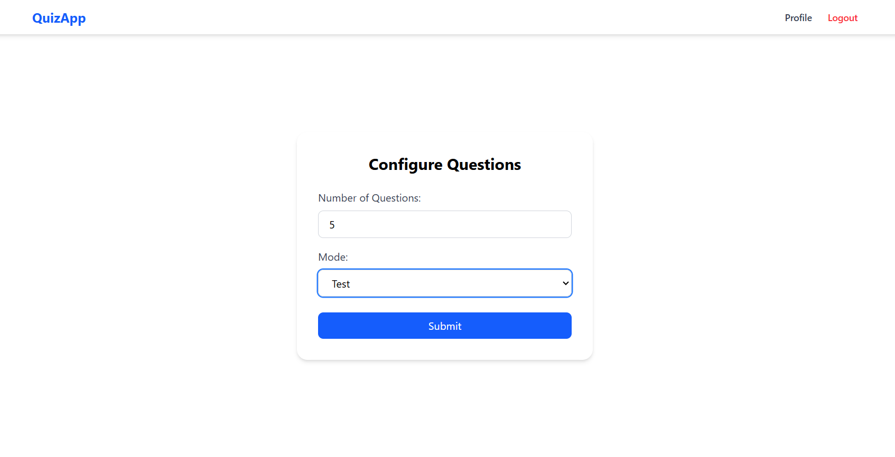
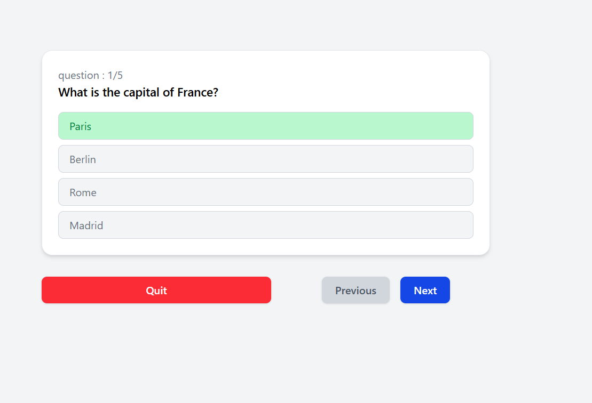
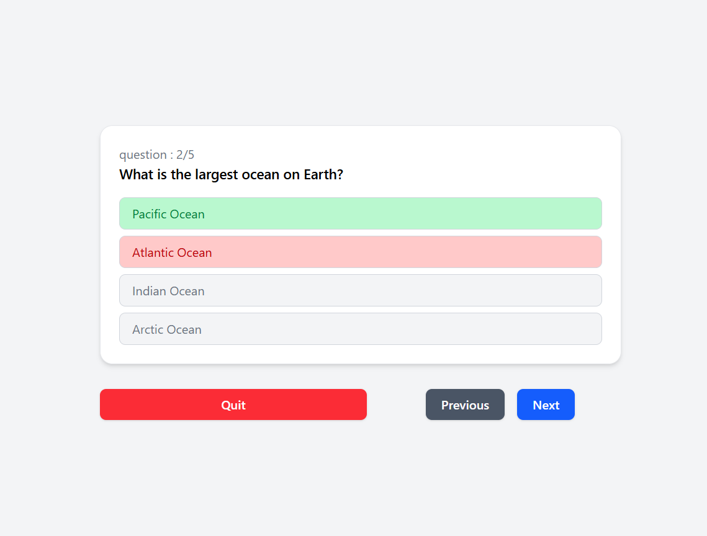
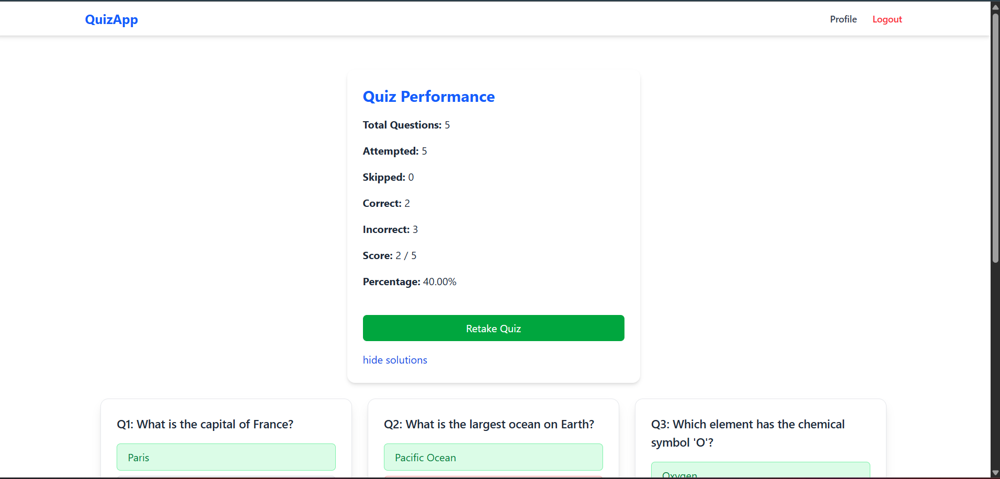
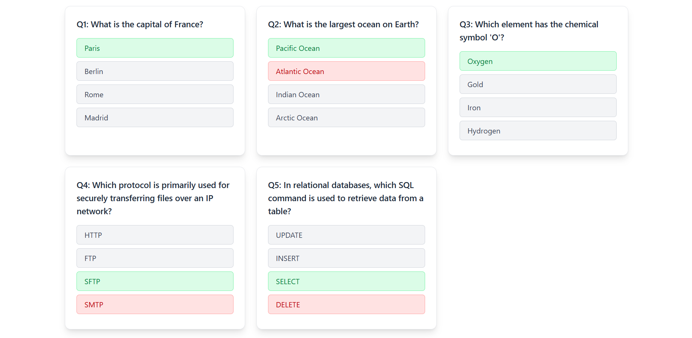

## Quiz App
A full stack Quiz web application with admin panel.

## Description
This is a MERN stack application where frontend is built using React and backend is build using express and MySQL database. This application allows the user to take quiz in different modes. It has a admin panel from where admin can create ,Read, Delete and update Quiz Questions.

## Table of content
- [Key Feature](#key-features)
- [Technologies Used](#technologies-used)
- [Screenshots](#screenshots)
- [Backend](#backend)

## key features
`Admin`
- **Operations :** create, read, update and delete Quiz Question. Single or Multiple question can be added at once through a text editor.
- **Authentication :** Admin are authenticated using the JWT 

`User`
- **Operations :** Define the no. of question and choose mode(Test or Read).
- **Authentication :** Google OAuth and JWT is used for authentication.
- **Report :** summarizes a user quiz performance by calculating total questions, attempted, skipped, correct, incorrect answers, score etc.

## Technologies used
- **Frontend :** React, RTK, Tailwind css, axios
- **Backend :** NodeJS, Express, JWT, Prisma, passport-google-oauth20
- **Database :** MySQL

## Screenshots

#### Admin

#### User

## Backend
https://github.com/Sandesh-Ghimire0/quiz-backend